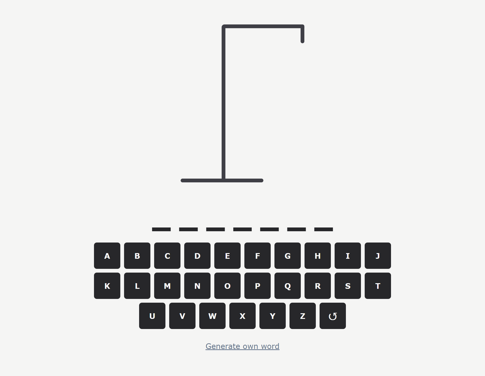
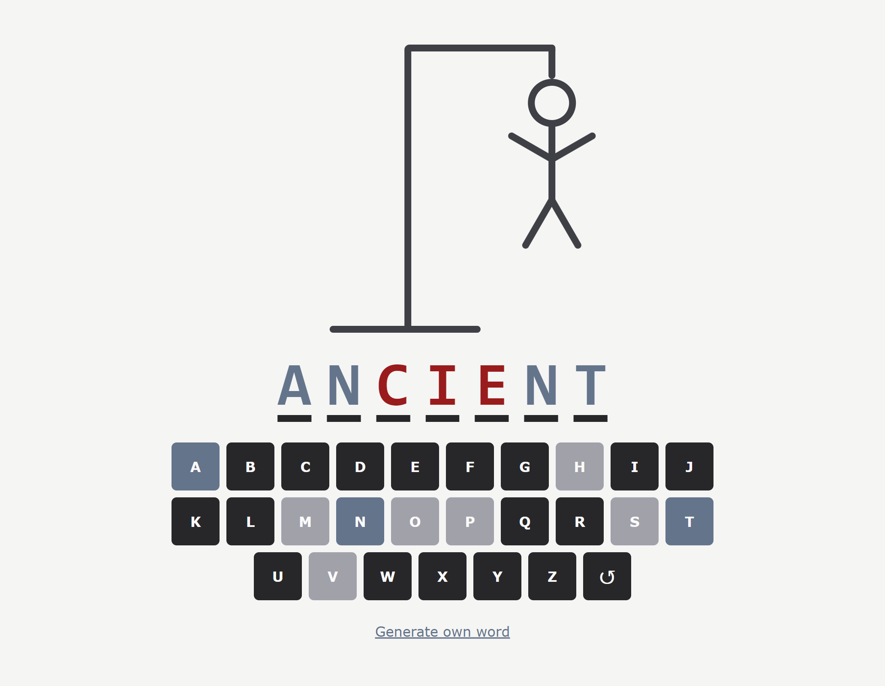

<!-- PROJECT LOGO -->
 

  <h3 align="center">Hangem</h3>

  

    Simple hangman game with sharing functionality.
     
     
    <a href="https://hangem.netlify.app">Live View</a>
    ·
    <a href="https://github.com/KaeserOfHonour/Hangem/issues">Report Bug</a>
    ·
    <a href="https://github.com/KaeserOfHonour/Hangem/issues">Request Feature</a>
  

  
Table of Contents

  <ol>
    <li>
      <a href="#about-the-project">About The Project</a>
      <ul>
        <li><a href="#built-with">Built With</a></li>
        <li><a href="#built-with">Screenshots</a></li>
      </ul>
    </li>
  </ol>

## About The Project

### Built With

-   [![Vite][Vitejs]][Vite-url]
-   [![React][React.js]][React-url]
-   [![TypeScript][TypeScriptlang]][TypeScript-url]
-   [![Tailwind][Tailwindcss]][Tailwind-url]

### Screenshots

[React.js]: https://img.shields.io/badge/React-20232A?style=for-the-badge&logo=react&logoColor=61DAFB
[React-url]: https://react.dev/
[Tailwindcss]: https://img.shields.io/badge/Tailwind_CSS-38B2AC?style=for-the-badge&logo=tailwind-css&logoColor=white
[Tailwind-url]: https://tailwindcss.com/
[TypeScriptlang]: https://img.shields.io/badge/TypeScript-007ACC?style=for-the-badge&logo=typescript&logoColor=white
[TypeScript-url]: https://www.typescriptlang.org/
[Vitejs]: https://img.shields.io/badge/vite-%23646CFF.svg?style=for-the-badge&logo=vite&logoColor=white
[Vite-url]: https://vitejs.dev/
